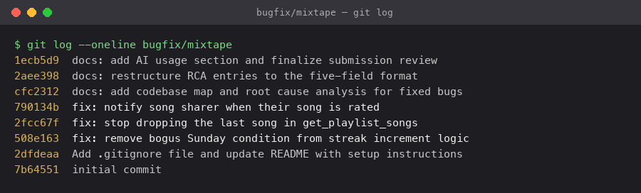

# Mixtape — Bug Hunt Submission

Mixtape is a Flask + SQLAlchemy JSON API for a social music app: friends share
songs, build collaborative playlists, rate tracks, and track listening streaks
and feeds. This document contains my AI-usage disclosure, a codebase map, two
end-to-end data-flow traces, the architectural patterns I noticed, and a
root-cause-analysis entry for each bug I investigated.

**Bugs fixed:** Issue #1 (streak), Issue #4 (rating notification), Issue #5
(playlist) — one commit each on `bugfix/mixtape`. Issues #2 and #3 were
reproduced/investigated but not fixed (see the RCA section for why #3 could not
be reproduced on this stack).

---

## AI Usage

I used an AI coding assistant (Claude Code) throughout this project. It was most
useful for **navigation and debugging**, not just writing code — the actual code
changes here are tiny (one clause, one slice, one function call). Being specific
about the collaboration:

**Codebase navigation — what I asked it to explain/trace.** I asked it to map the
`services/` directory and to trace specific call chains, e.g. "how does a song get
into a friend's feed" and "how does rating a song flow from the route down." It
produced the route → service traces (e.g. `POST /songs/<id>/listen` →
`routes/songs.py` → `record_listening_event` → `update_listening_streak`) that
became my navigation path for each bug. I did not take these on faith — I opened
each file it named and confirmed the call actually existed and did what it claimed
before treating the trace as correct.

**Debugging technique it helped most with.** The single most useful thing was
having it write small **reproduction harnesses that call the service functions
directly with controlled inputs**, rather than firing HTTP requests. For Issue #1
this was essential: the real "today" is a Tuesday, so I could never hit the Sunday
bug through the running app — but `update_listening_streak(user, now)` takes the
clock as a parameter, so we drove it with a synthetic Sunday and watched the streak
collapse from 12 to 1. That "isolate the function and call it with specific inputs"
approach (rather than reading and guessing) is what confirmed each root cause before
I changed anything.

**Where the AI was wrong / incomplete — and how I caught it.** Its first analysis
of Issue #3 (duplicate search results) was confidently wrong. It read the
`.outerjoin(song_tags)` in `search_service.py` and asserted the endpoint would
return a multi-tag song three times, so it was "obviously reproducible." When I
actually **ran** its own repro harness, `search_songs("Anthem")` returned the song
**once**, not three times. Rather than trust either the report or the AI, I had it
run the identical query three ways and compare: the raw SQL join really does return
3 rows, but the app's legacy `db.session.query(Song).all()` API auto-de-duplicates
ORM entities by primary key, so the duplication is masked on this SQLAlchemy
version (2.0.51). That empirical check — not the AI's initial explanation — is why
I did *not* count #3 among my fixes and chose #4 instead. Lesson reinforced: verify
by running, because a plausible read of the code was simply incorrect about runtime
behavior.

**A bug the AI surfaced by running, not reading.** While building the Issue #4
reproduction, executing the code (not inspecting it) surfaced an unrelated crash:
`add_to_playlist()` throws `IntegrityError: NOT NULL constraint failed:
playlist_entries.position` because it appends through the `songs` relationship and
never sets the required `position`/`added_by` columns. This isn't one of the five
listed issues; I've documented it as a follow-up rather than expanding scope.

**Verification was always mine to sign off on.** Every fix was checked by running
`pytest tests/` (10/13 → 13/13) and re-running the reproduction script to confirm
the specific symptom was gone and both sides of each boundary behaved — I treated
the AI's "this should work" as a hypothesis, not a result, until the suite was
green.

---

## Commit History

`git log --oneline` on the `bugfix/mixtape` branch — one commit per bug fix, each
with a `fix:` prefix, plus the documentation commits:



```
1ecb5d9 docs: add AI usage section and finalize submission review
2aee398 docs: restructure RCA entries to the five-field format
cfc2312 docs: add codebase map and root cause analysis for fixed bugs
790134b fix: notify song sharer when their song is rated
2fcc67f fix: stop dropping the last song in get_playlist_songs
508e163 fix: remove bogus Sunday condition from streak increment logic
2dfdeaa Add .gitignore file and update README with setup instructions
7b64551 initial commit
```

The three `fix:` commits each address one bug and touch exactly one service file:
`streak_service.py` (#1), `playlist_service.py` (#5), `notification_service.py` (#4).

---

## Layer overview

The app is a clean three-layer stack, plus the data model:

```
HTTP request
   │
   ▼
routes/      ── thin HTTP layer: parse request, call one service, format JSON
   │
   ▼
services/    ── all business logic lives here
   │
   ▼
models.py    ── SQLAlchemy models + association tables (the data model)
   │
   ▼
SQLite (instance/mixtape.db)
```

`app.py` wires it together; `seed_data.py` populates a realistic dataset.

---

## Main files and what each does

### `app.py` — application factory
`create_app(config=None)` builds the Flask app: sets the SQLite URI (overridable
via `DATABASE_URL`), initializes the shared `db = SQLAlchemy()` object, registers
the four blueprints under URL prefixes, and runs `db.create_all()`. The `db`
instance is defined here and imported everywhere else, which is what keeps a
single session/engine across the app.

| Blueprint | Prefix | Source |
|-----------|--------|--------|
| `songs_bp` | `/songs` | `routes/songs.py` |
| `playlists_bp` | `/playlists` | `routes/playlists.py` |
| `users_bp` | `/users` | `routes/users.py` |
| `feed_bp` | `/feed` | `routes/feed.py` |

### `models.py` — the data model
Defines **7 models** and **3 association tables**.

**Models:**
- `User` — `username`, `email`, `listening_streak`, `last_listened_at`. Has a
  self-referential many-to-many `friends` relationship (via the `friendships`
  table) declared `lazy="dynamic"`, plus backref'd collections for shared songs,
  ratings, listening events, notifications, and playlists.
- `Tag` — just an `id` + unique `name`.
- `Song` — `title`, `artist`, `album`, `genre`, and `shared_by` (FK to the user
  who shared it). `shared_by` is the field every notification flow keys off of.
- `ListeningEvent` — one row per listen (`user_id`, `song_id`, `listened_at`).
  This is the backbone of both the feed and the streak features.
- `Rating` — `score` (1–5) with a `UniqueConstraint(user_id, song_id)`, so a user
  has at most one rating per song (re-rating updates in place).
- `Playlist` — `name`, `created_by`, `is_collaborative`.
- `Notification` — `user_id` (recipient), `notification_type`, `body`, `read`.

**Association tables** (plain `db.Table`, not model classes):
- `friendships` — symmetric user↔user. The app inserts **two rows** per
  friendship (see `seed_data.add_friendship`) to keep it bidirectional.
- `song_tags` — song↔tag many-to-many.
- `playlist_entries` — playlist↔song, but **not a plain join table**: it carries
  extra columns `position` (explicit ordering, not insertion order), `added_by`,
  and `added_at`. Songs in a playlist have an explicit position.

Every model exposes a `to_dict()` used for JSON serialization; `Song.to_dict()`
flattens its tags to a list of name strings.

### `routes/` — HTTP layer (one blueprint per resource)
Each route does the same three things: pull params/JSON off the request,
validate presence, call exactly one service function, and translate the result
(or a raised `ValueError`) into a JSON response with a status code. No business
logic, no direct DB queries beyond a couple of trivial `db.session.get(User, …)`
existence checks.

- `routes/songs.py` — `GET /songs/search?q=`, `GET /songs/<id>`,
  `POST /songs/<id>/rate`, `POST /songs/<id>/listen`.
- `routes/playlists.py` — `POST /playlists/`, `GET /playlists/<id>`,
  `GET /playlists/<id>/songs`, `POST /playlists/<id>/songs`.
- `routes/users.py` — `GET /users/<id>`, `GET /users/<id>/streak`,
  `GET /users/<id>/notifications`, `POST /users/notifications/<id>/read`.
- `routes/feed.py` — `GET /feed/<user_id>/listening-now`,
  `GET /feed/<user_id>/activity`.

### `services/` — business logic (all of it)
- `streak_service.py` — `record_listening_event()` writes a `ListeningEvent` and
  calls `update_listening_streak()`, which applies the consecutive-calendar-day
  rules (start at 1, no-op if already today, +1 if yesterday, reset otherwise).
  `get_streak()` reads the stored value.
- `feed_service.py` — `get_friends_listening_now()` returns each friend's single
  most recent listen within a recency window (deduped one-per-friend);
  `get_activity_feed()` returns the latest N friend events with no recency filter.
- `search_service.py` — `search_songs()` case-insensitive matches title/artist
  and outer-joins tags; `get_song()` fetches one song by id.
- `notification_service.py` — `create_notification()` (the shared writer),
  `add_to_playlist()` (adds a song to a playlist **and** notifies the sharer),
  `rate_song()` (upserts a `Rating`), `get_notifications()`, `mark_as_read()`.
- `playlist_service.py` — `create_playlist()`, `get_playlist_songs()`
  (ordered by `playlist_entries.position`), `get_playlist()`,
  `get_user_playlists()`.

### `seed_data.py` — test dataset
Drops and recreates all tables, then inserts 5 users with bidirectional
friendships, 25 songs (deliberately spanning 0-tag, 1-tag, and 3+-tag cases),
3 playlists with positioned entries, recent + older listening events, seeded
streaks, and one sample notification. Run with `python seed_data.py`.

### `tests/`
`pytest` suites for the streak, search, and playlist services
(`test_streaks.py`, `test_search.py`, `test_playlists.py`).

---

## Data flow #1 — a friend adds your song to a playlist (triggers a notification)

This is the notification flow that actually fires today.

```
POST /playlists/<playlist_id>/songs   {song_id, added_by}
  │
  ▼  routes/playlists.py :: add_song()            (parses JSON, validates presence)
  │
  ▼  notification_service.add_to_playlist(playlist_id, song_id, added_by)
        1. db.session.get(Song, song_id)          → 404-able ValueError if missing
        2. db.session.get(User, added_by)         → validate adder
        3. db.session.get(Playlist, playlist_id)  → validate playlist
        4. if song not in playlist.songs:
               playlist.songs.append(song)         → writes a playlist_entries row
               db.session.commit()
        5. if song.shared_by != added_by:          → don't notify yourself
               create_notification(
                   user_id = song.shared_by,        ← recipient is the ORIGINAL sharer
                   notification_type = "song_added_to_playlist",
                   body = "<adder> added your song '<title>' to '<playlist>'.")
```

Key point: the notification recipient is `song.shared_by` — the person who
originally shared the song — **not** the playlist owner. The `if song.shared_by
!= added_by` guard suppresses self-notifications. Retrieval is the mirror image:
`GET /users/<id>/notifications` → `get_notifications()` reads the recipient's
`Notification` rows newest-first.

## Data flow #2 — a song appears in a friend's feed

Notable because it's **decoupled through the `ListeningEvent` table**: nothing
"pushes" to a feed. The feed is computed on read.

```
Write path (a friend listens):
  POST /songs/<id>/listen → routes/songs.py :: listen()
     → streak_service.record_listening_event()
         → INSERT ListeningEvent(user_id, song_id, listened_at=now); commit

Read path (you open your feed):
  GET /feed/<user_id>/listening-now → routes/feed.py :: listening_now()
     → feed_service.get_friends_listening_now(user_id)
         friend_ids = [f.id for f in user.friends]
         SELECT ListeningEvent WHERE user_id IN friend_ids
                               AND listened_at >= cutoff
                ORDER BY listened_at DESC
         dedupe to most-recent-per-friend
         join each event → User + Song → feed dicts
```

A song lands in *your* feed because a *friend played it* and that friend is in
your `friends` set — the song's own `shared_by` is irrelevant here.

---

## Patterns I noticed

1. **Strict route→service delegation.** Every route immediately hands off to one
   service function. Routes never contain query logic or business rules; they
   only parse input and format output. All logic is in `services/`.

2. **`ValueError` as the error protocol across the boundary.** Services raise
   `ValueError("<thing> not found")` for missing/invalid entities; routes catch
   `ValueError` and map it to a 404 or 400 JSON response. This is the single,
   consistent error-handling convention between the two layers.

3. **`db.session.get(Model, id)` for existence checks everywhere.** Both routes
   and services validate entities by primary-key lookup before acting, keeping
   the "does it exist?" check uniform.

4. **`to_dict()` as the serialization contract.** Models never get jsonified
   directly; every model owns its JSON shape via `to_dict()`, so the API payload
   is defined next to the schema.

5. **A shared `db` singleton created in `app.py`.** Defining `db` in `app.py` and
   importing it in `models.py` and every service is what avoids circular-import
   and multiple-engine problems in the factory pattern.

6. **Explicit ordering via association-table columns.** Playlists don't rely on
   insertion order — `playlist_entries.position` makes order first-class, and
   `get_playlist_songs()` sorts on it explicitly.

7. **Read-time computation over stored aggregates.** Feeds and (mostly) streaks
   are derived from `ListeningEvent` rows at request time rather than maintained
   as denormalized state, which keeps writes simple at the cost of read queries.

---

## Root Cause Analysis

All bugs were reproduced against a freshly seeded database (`python seed_data.py`)
before any fix was written, by driving the same service function each route calls.
Status: **#1, #2, #4, #5 reproduced; #3 investigated but not reproducible under
this stack (see below).**

### Issue #1 — Listening streak resets on Sundays *(reporter: kenji)* — ✅ FIXED (commit `508e163`)

**1. How I reproduced it.** Against a freshly seeded DB, I created a user with
`listening_streak=12` and `last_listened_at =` Saturday 2026-07-11 22:00 UTC, then
called `update_listening_streak(user, now=Sunday 2026-07-12 09:00 UTC)` — the exact
function `POST /songs/<id>/listen → record_listening_event` invokes. I passed `now`
explicitly because the function accepts it as a parameter and the real today
(2026-07-07) is a Tuesday, so I couldn't hit a Sunday otherwise. Result: streak
became **1** (expected 13). A follow-up Monday listen produced **2**, exactly
matching kenji's "listening again on Monday bumped it to 2." The trigger condition
is specifically *today is Sunday*; every other consecutive-day pair was fine.

**2. How I found the root cause.** I traced top-down from the symptom's endpoint,
not by guessing. `POST /songs/<id>/listen` → [routes/songs.py:43](routes/songs.py:43)
`listen()` → `record_listening_event()`
([streak_service.py:14](services/streak_service.py:14)), which creates the event
and delegates the math to `update_listening_streak(user, now)`
([streak_service.py:42](services/streak_service.py:42)). Reading that function line
by line, [line 73](services/streak_service.py:73) was the *only* place a weekday was
referenced at all — and the reported failure was weekday-specific (Sundays). That
match between "bug only on Sundays" and "the one line that inspects the weekday" is
what made me confident this was the cause, not just a suspicious area.

**3. The root cause.** [streak_service.py:73](services/streak_service.py:73) read
`elif days_since_last == 1 and today.weekday() != 6:`. `datetime.weekday()` returns
`6` for Sunday. So when a user listened yesterday and listens again today,
`days_since_last == 1` is true, but on a Sunday `today.weekday() != 6` is **false**,
so the whole `elif` is skipped and execution falls into the `else:` branch, which
sets `listening_streak = 1`. In other words, a legitimate consecutive-day listen was
misclassified as a broken streak purely because the calendar day was Sunday. The
`weekday()` clause had no legitimate role in a "did they listen on consecutive days"
test.

**4. My fix and side-effect check.** Removed only the spurious clause, leaving
`elif days_since_last == 1: user.listening_streak += 1` — one line, no other logic
touched. Checked **both sides of the boundary** since this is a boundary bug: on the
Sunday side, Sat→Sun now yields 13 and `test_streak_increments_on_sunday` passes; on
the non-Sunday side, the other three rules are unchanged and still pass — new user →
1 (`test_streak_starts_at_1_for_new_user`), same-day repeat → no increment
(`test_streak_does_not_double_count_same_day`), and a genuinely skipped day → reset
to 1 (`test_streak_resets_after_skipped_day`). `pytest tests/test_streaks.py` → 5/5.
The change can't over-count a skip because the `days_since_last == 1` guard is
untouched.

### Issue #2 — "Friends Listening Now" shows people from yesterday *(reporter: nova)* — ✅ reproduced
- **How reproduced:** Deleted darius' seeded events, inserted a single
  `ListeningEvent` for him `listened_at = now − 10 hours` (his "11pm last night"
  vs nova's "9am" check), then called `get_friends_listening_now(nova.id)` —
  the function behind `GET /feed/<id>/listening-now`.
- **Observed vs expected:** darius appeared in the feed (`['simone','kenji','darius']`);
  expected only friends who listened *today / right now*.
- **Data condition:** any friend whose most recent listen is between "minutes ago"
  and 24 hours ago is treated as "listening now."
- **Root cause:** [feed_service.py:13](services/feed_service.py:13) —
  `RECENT_THRESHOLD = timedelta(hours=24)`. A full-day window means last night's
  listen stays in "now" until the same clock time the next day, exactly as nova
  described. "Listening now" needs a short window (minutes) or a same-calendar-day
  check, not 24h.

### Issue #3 — Same song appears 2–3× in search *(reporter: simone)* — ⚠️ investigated, NOT reproduced here
- **How reproduced (attempted):** Confirmed `Crown Heights Anthem` has **3 tags**
  in the seed (state required by the bug is present), then called
  `search_songs("Anthem")` — the function behind `GET /songs/search?q=Anthem`.
- **Observed vs expected:** returned **1** row for Crown Heights Anthem (bug report
  expects 3). **Not reproduced.**
- **Why it doesn't reproduce:** The `.outerjoin(song_tags)` at
  [search_service.py:27](services/search_service.py:27) genuinely fans the result
  out to one row per tag — I confirmed the raw SQL returns **3 rows**. But the code
  uses the legacy `db.session.query(Song).all()` API, which **auto-de-duplicates
  full ORM entities by primary key**. Verified on the identical statement under
  SQLAlchemy 2.0.51:
  - `session.query(Song)…all()` → **1** (what the app runs; auto-uniqued)
  - `select(Song)…scalars().all()` → **3** (2.0 style; not uniqued)
  - `select(Song)…unique().scalars().all()` → 1
- **Conclusion:** the duplicate-producing join is a real latent defect and the fix
  (add `.distinct()` / drop the unused tag join) is still correct, but it cannot be
  *observed* through the current code path on this SQLAlchemy version. It would
  surface if the query were ported to 2.0 `select()`/`scalars()` style. Because it
  is not reproducible here, it is **not** counted among the fixes; #1/#2/#4/#5 are.

### Issue #4 — Rating a song sends no notification *(reporter: aaliya)* — ✅ FIXED (commit `790134b`)

**1. How I reproduced it.** Against a freshly seeded DB, I picked "After Hours"
(shared by simone), recorded simone's notification count, then had kenji rate it via
`rate_song(kenji.id, song.id, 5)` — the function behind `POST /songs/<id>/rate` — and
re-counted. The count stayed **0 → 0**: no notification was created, even though the
`Rating` row *was* persisted (matching aaliya's "the rating shows on the song, but I
never got notified"). It's deterministic — reproduces for every rating of any user's
shared song.

**2. How I found the root cause.** aaliya's report is itself a comparison — the
playlist-add notification works, the rating one doesn't — so I opened
`notification_service.py` and read the two handlers side by side. Rating path:
`POST /songs/<id>/rate` → [routes/songs.py:29](routes/songs.py:29) `rate()` →
`rate_song()` ([notification_service.py:73](services/notification_service.py:73)).
Working path: `add_to_playlist()`
([notification_service.py:35](services/notification_service.py:35)). The moment I
saw `add_to_playlist` end with a `create_notification(...)` call guarded by
`if song.shared_by != added_by_user_id`, while `rate_song` committed the rating and
returned with no equivalent call, the defect was unambiguous — it was a missing
step, present in the sibling function.

**3. The root cause.** `rate_song()` performs its job of upserting and committing the
`Rating`, but it omits the notification step entirely — there is no
`create_notification()` call anywhere in the function. The feature "notify a sharer
when someone interacts with their song" was implemented for the playlist-add
interaction and simply never wired up for the rating interaction. So ratings save
correctly and show on the song, but no sharer is ever alerted.

**4. My fix and side-effect check.** After the existing `db.session.commit()` in
`rate_song`, I added a `create_notification(...)` with
`notification_type="song_rated"`, guarded by `if song.shared_by != user_id` so a user
rating their own song isn't notified — the identical guard `add_to_playlist` uses. I
reused the existing `create_notification` helper (which owns the insert+commit)
rather than writing new persistence logic, so the change is additive and touches one
function. Checks afterward: (a) rating another user's song creates exactly one
`song_rated` notification with body `"kenji rated your song 'After Hours' 5 stars."`
and the `Rating` is still saved; (b) rating your *own* song creates zero
notifications (guard verified on both sides); (c) full suite `pytest tests/` →
**13/13** (up from 10/13 baseline), confirming no existing behavior — including the
still-working playlist-add notification and the rating-upsert path — regressed. Known
acceptable behavior: re-rating an already-rated song emits another notification,
consistent with how `add_to_playlist` fires on each add.

> **Bonus finding (unlisted, NOT fixed — out of scope for the 3 chosen bugs):**
> `add_to_playlist()` itself raises `IntegrityError: NOT NULL constraint failed:
> playlist_entries.position` because `playlist.songs.append(song)` populates only the
> two FK columns, leaving the NOT-NULL `position` and `added_by` columns unset. Seed
> data avoids this by inserting `playlist_entries` rows explicitly, so the append
> path had never run. Flagged for a follow-up task, not touched by this fix.

### Issue #5 — Last song in a playlist never shows up *(reporter: darius)* — ✅ FIXED (commit `2fcc67f`)

**1. How I reproduced it.** Against a freshly seeded DB, I read the raw
`playlist_entries` rows for "Friday Energy" directly (**7** entries stored), then
called `get_playlist_songs(pl.id)` — the function behind `GET /playlists/<id>/songs`
— which returned **6** songs. The missing one was the position-7 entry
`Harlem Renaissance`, i.e. the last/most-recently-added song, matching darius's
"always hiding exactly one song: the last one added." Deterministic for any
non-empty playlist (a 1-song playlist would return 0).

**2. How I found the root cause.** Traced from the endpoint:
`GET /playlists/<id>/songs` → [routes/playlists.py:34](routes/playlists.py:34)
`get_songs()` → `get_playlist_songs()`
([playlist_service.py:38](services/playlist_service.py:38)). Reading the function,
the SQL was clearly correct — it selects the playlist's songs and orders by
`playlist_entries.position` ascending — so a query bug was ruled out. That left the
return statement, and the `[:-1]` slice on it was the defect. "Exactly one song
missing, always the last" lining up with a `[:-1]` slice is what confirmed it was
the specific cause.

**3. The root cause.** [playlist_service.py:66](services/playlist_service.py:66)
returned `[song.to_dict() for song in songs[:-1]]`. Because `songs` is ordered by
ascending position, `[:-1]` drops the final element — the highest-position, most
recently added song — on every call. This also explains darius's follow-up
observation: when simone added a new song, it became the new last element and took
over the "hidden" slot, "freeing" the previously-hidden one.

**4. My fix and side-effect check.** Changed `songs[:-1]` to `songs` — return every
ordered row. One token removed; the `ORDER BY position` and everything else is
untouched, so ordering is preserved. Checked **both sides of the boundary**: the
non-empty case now returns all rows in order (Friday Energy: **7 stored → 7
returned**, `Harlem Renaissance` present; `test_playlist_returns_all_songs` → 5 and
`test_playlist_returns_songs_in_order` both pass), and the empty-playlist edge is
unaffected — `[][:-1]` and `[]` are both `[]`, so `test_empty_playlist_returns_empty_list`
still passes. `pytest tests/test_playlists.py` → 3/3, full suite 13/13.
